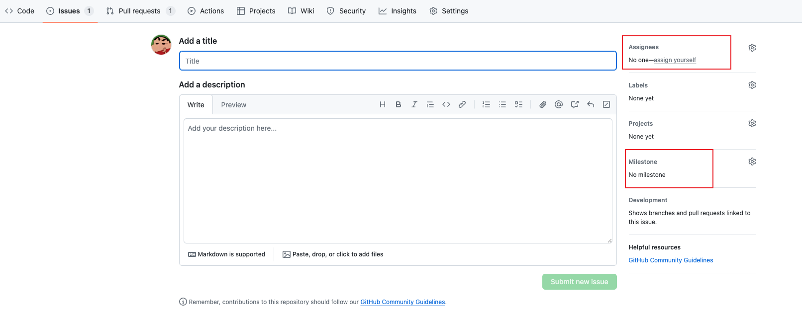
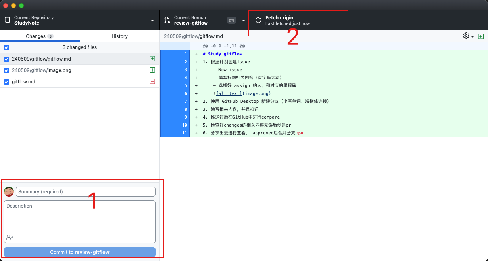
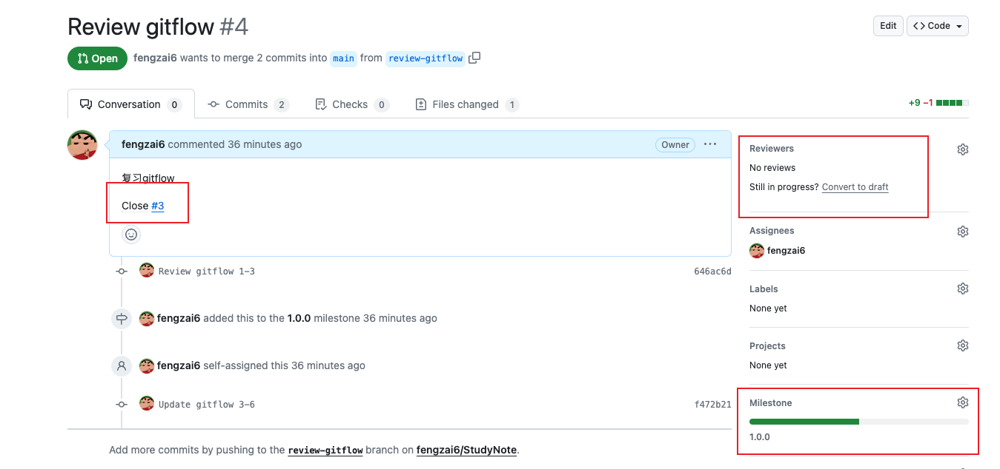
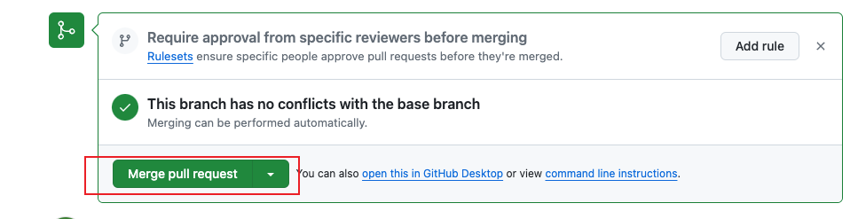

# Study gitflow
1. 根据计划创建issue
    - New issue
    - 填写标题相关内容（首字母大写）
    - 选择好 assign 的人，和对应的里程碑
    
2. 使用 GitHub Desktop 新建分支（小写单词、短横线连接）
3. 编写相关内容，并且推送

4. 推送过后在GitHub中进行compare
5. 检查好changes的相关内容无误后创建pr
    - 选择好 assign 的人，和对应的里程碑，close 对应的issue
    
6. 分享出去进行查看， approved后合并分支
